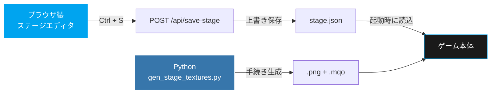
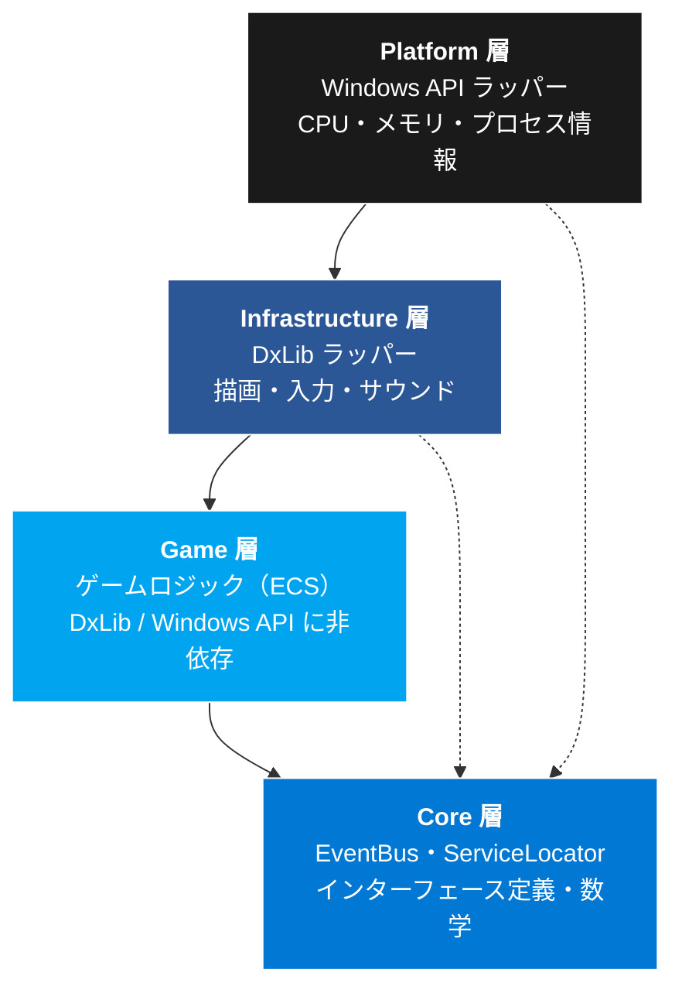

<div align="center">

```
██╗    ██╗██╗███╗   ██╗  ██╗   ██╗███████╗  ███╗   ███╗ █████╗  ██████╗
██║    ██║██║████╗  ██║  ██║   ██║██╔════╝  ████╗ ████║██╔══██╗██╔════╝
██║ █╗ ██║██║██╔██╗ ██║  ██║   ██║███████╗  ██╔████╔██║███████║██║     
██║███╗██║██║██║╚██╗██║  ╚██╗ ██╔╝╚════██║  ██║╚██╔╝██║██╔══██║██║     
╚███╔███╔╝██║██║ ╚████║   ╚████╔╝ ███████║  ██║ ╚═╝ ██║██║  ██║╚██████╗
 ╚══╝╚══╝ ╚═╝╚═╝  ╚═══╝    ╚═══╝  ╚══════╝  ╚═╝     ╚═╝╚═╝  ╚═╝ ╚═════╝
```


[](#)
[](#)
[](#)
[](#)
[](#)

**個人開発 / 就職活動向けポートフォリオ作品**

</div>

---

## GAME OVERVIEW

> **Windows OS の内部に侵入してきた Mac 軍を、自分の PC を武器に迎撃する 3D アクション。**
> プレイヤーはセキュリティエージェントとして Desktop から System32 の深層まで 5 区画を潜り、
> 最終ボス **MacBook** を撃退する。

<div align="center">


</div>

### CONTROLS

| 操作 | キーボード / マウス | ゲームパッド |
|:---|:---|:---|
| **移動** | `W` `A` `S` `D` / `↑` `←` `↓` `→` | 左スティック / 十字キー |
| **視点** | マウス移動 | 対応 |
| **近接攻撃** | `左クリック` | 対応 |
| **遠距離攻撃（Window弾）** | `右クリック` | 対応 |
| **ジャンプ** | `Space` | 対応 |
| **ダッシュ** | `Shift` | 対応 |
| **ポーズ** | `Esc` | 対応 |

<details>
<summary><b>デバッグ操作（開発用）</b></summary>

<br>

| キー | 機能 |
|:---|:---|
| `F1` | デバッグモード（フリーカメラ） |
| `F2` | シーンビュー（時間停止＋自由視点） |
| `T` | テストエフェクト再生 |

</details>

---

## TECH HIGHLIGHTS

<div align="center">

| SCALE | ARCHITECTURE | OPTIMIZATION |
|:---:|:---:|:---:|
| **313** files | **Layered + ECS** | **3.5GB → 1.3GB** |
| `.cpp` 106 / `.h` 207 | シングルトン **0 個** | メモリ使用量 **-63%** |
| System **32** 本 | 依存は常に一方向 | テクスチャ1024px化 / BGMストリーミング |

</div>

### 依存の向きを設計で固定する

```
platform  →  infrastructure  →  game  →  core
(Windows API)     (DxLib)    (ロジック)   (基盤)
```

**内側の層は外側の層を include しない。** Game 層は DxLib も Windows API も知らず、
描画も入力も OS 情報も、すべて Core 層のインターフェース越しに触ります。

```cpp
// Game層が知っているのはインターフェースだけ。DxLibの型は一切現れない
class InGame {
    core::iface::IRenderer&      m_renderer;  // 実体は infrastructure::graphics::Renderer
    core::iface::ICamera&        m_camera;
    core::iface::IInputProvider& m_input;
};
```

### シングルトンを 1 つも使わない

`Application` を唯一のコンポジションルートとし、生成した実体を参照で注入します。
`ServiceLocator` は **登録の逆順で破棄** することで、デストラクタ内から他サービスを
参照しても未定義動作にならないことを保証しています。

> [!NOTE]
> グローバル状態を排したことで、シーンの生成順・破棄順がコード上で完全に追えます。
> 「どこからでも触れる」便利さより「どこから触られるか分かる」ことを優先しました。

---

## IN-HOUSE TOOLS

ゲーム本体だけでなく、**制作を支えるツールも自作**しています。



### STAGE EDITOR — 座標を手書きしない

ブラウザ製エディタで配置物・ライト・敵をドラッグ配置し、`Ctrl + S` で
**JSON を直接上書き保存**。ゲームは起動時にその JSON を読むだけなので、
エディタで動かした結果がそのまま実機に反映されます。

| 機能 | 内容 |
|:---|:---|
| カタログ自動読込 | `stageCatalog.json` から配置可能オブジェクトを取得 |
| テクスチャ表示 | 実機と同じ絵をエディタ上でプレビュー |
| ライト配置 | 位置・範囲・色を GUI で編集 |
| 上書き保存 | ブラウザのダウンロードではなく、ローカルサーバー経由で実ファイルへ |

### PROCEDURAL ASSETS — テクスチャとモデルをコードで生成

`tools/gen_stage_textures.py` が **Pillow でテクスチャ (.png)** を描き、
同時に **UV 付き立方体モデル (.mqo)** をテキスト形式で出力します。

```python
# 「データ壁」はUVを縦にずらして流すため、上下が繋がるよう行間をSIZEの約数にする
line_height = SIZE // len(DATA_LINES)
```

グレーボックスを 1 つのキューブモデルで賄い、`size ÷ baseSize` でスケールさせる方式に
したことで、**床・壁・柱・ブロックすべてが同じパイプラインに乗る**構成になっています。

---

## DATA-DRIVEN DESIGN

**敵の派生クラスを 1 つも作っていません。**
`Enemy` を継承した `Safari` / `Xcode` …ではなく、JSON に書いた
**振る舞いとアニメーションの組み合わせ**で敵を定義します。

```jsonc
// assets/data/enemies/xcodeData.json
{
  "gameplay": { "moveSpeed": 220.0, "attackRange": 200.0, "attackWindup": 1.85 },

  "behaviors": [ "meleeChase", "patrol" ],          // ← 振る舞いを組み合わせる
  "animations": [
    { "state": "Idle",    "id": "anim_xcode_idle" },
    { "state": "Attack1", "id": "anim_xcode_ground_slam",
      "loop": false, "onComplete": "Idle", "priority": "attack", "speed": 2.0 }
  ]
}
```

### 現在の敵構成

| 敵 | behaviors | 特徴 |
|:---|:---|:---|
| **Safari** | `rangeKeep` `patrol` | 浮遊型ドローン。距離を保って射撃 |
| **Xcode** | `meleeChase` `patrol` | 近接型。長い溜めから範囲攻撃 |
| **MacBook**（ボス） | `boss` | フェーズ制。虹ビーム・召喚・ノヴァ |

新しい敵を追加したいとき、**書くのは C++ ではなく JSON 1 ファイル**です。
`"behaviors": ["meleeChase", "patrol"]` を別の組み合わせに変えれば、
そのまま違う挙動の敵になります。

> [!TIP]
> アニメーションも `priority`（locomotion / attack / hit / dying）で衝突を解決するため、
> 「攻撃中に歩行モーションで上書きされる」といった問題が仕組みとして起きません。

---

## ARCHITECTURE



### ECS (Entity-Component-System)

- **Entity** … ただの ID
- **Component** … データのみ（座標・HP・AI 情報）
- **System** … 処理のみ（32 本）

```cpp
// Player は「クラス」ではなくComponentの組み合わせで定義される
EntityId player = entityManager.create();
componentManager.add<TransformComponent>(player, {});
componentManager.add<HealthComponent>(player, {});
componentManager.add<RenderComponent>(player, { modelHandle });
componentManager.add<FallRecoveryComponent>(player, {});  // 奈落から復帰する能力を後付け
```

継承ツリーではなく組み合わせなので、**「奈落から復帰する敵」を作りたければ
`FallRecoveryComponent` を足すだけ**で済みます。

---

## PROJECT STRUCTURE

```
src/
├── core/                 # 全層共通の基盤（外部ライブラリに非依存）
│   ├── ecs/             # Entity / Component / System 実装
│   ├── interface/       # IRenderer, ICamera, IInputProvider …
│   ├── data/            # ステージ・配置物のメタデータ定義
│   └── utility/         # Vector3, Rotation, Color, Log
├── game/                 # ゲームロジック
│   ├── component/       # データのみのComponent
│   ├── system/          # 処理のみのSystem（32本）
│   ├── scene/           # Title / Bios / InGame / Result
│   ├── stage/           # ステージ配置物
│   ├── factory/         # Entity 生成
│   └── event/           # EventBus 用イベント定義
├── infrastructure/       # DxLib ラッパー
└── platform/             # Windows API ラッパー

tools/
├── stage-editor/            # ブラウザ製ステージエディタ
├── serve_editor.py          # エディタ用ローカルサーバー（JSON上書き保存）
├── gen_stage_textures.py    # テクスチャ + モデルの手続き生成
└── gen_stage_from_concept.py # コンセプトからステージJSONを生成
```

---

## BUILD & RUN

### 必要な環境

| 項目 | 要件 |
|:---|:---|
| **OS** | Windows 10 以上 |
| **IDE** | Visual Studio 2022（C++20 対応の MSVC） |
| **DxLib** | `thirdparty/` に同梱済み |
| **Python**（任意） | 3.10 以上。アセット生成・エディタ用サーバーに使用 |

### ビルド

```bash
git clone https://github.com/YutoImata/DxLib-3D.git
cd DxLib-3D
```

`DxLib-3D.sln` を Visual Studio で開き、構成 `Debug` / プラットフォーム `x64` でビルドします。

```powershell
# コマンドラインからビルドする場合
MSBuild.exe DxLib-3D.vcxproj /p:Configuration=Debug /p:Platform=x64
```

実行ファイルは `x64/Debug/DxLib-3D.exe` に出力されます。

### ステージエディタの起動

```bash
python tools/serve_editor.py
# → 表示された URL をブラウザで開く
```

---

## AUTHOR

<div align="center">

**YutoImata** — ソロ開発

企画・設計・実装・アセット生成・ツール制作まで全工程を担当

[](https://wine-5.github.io/portfolio/)
[](https://github.com/YutoImata)

</div>

---

<div align="center">

設計や実装への質問・指摘は Issue へお願いします。

**このプロジェクトはオープンソースではありません。**

</div>
