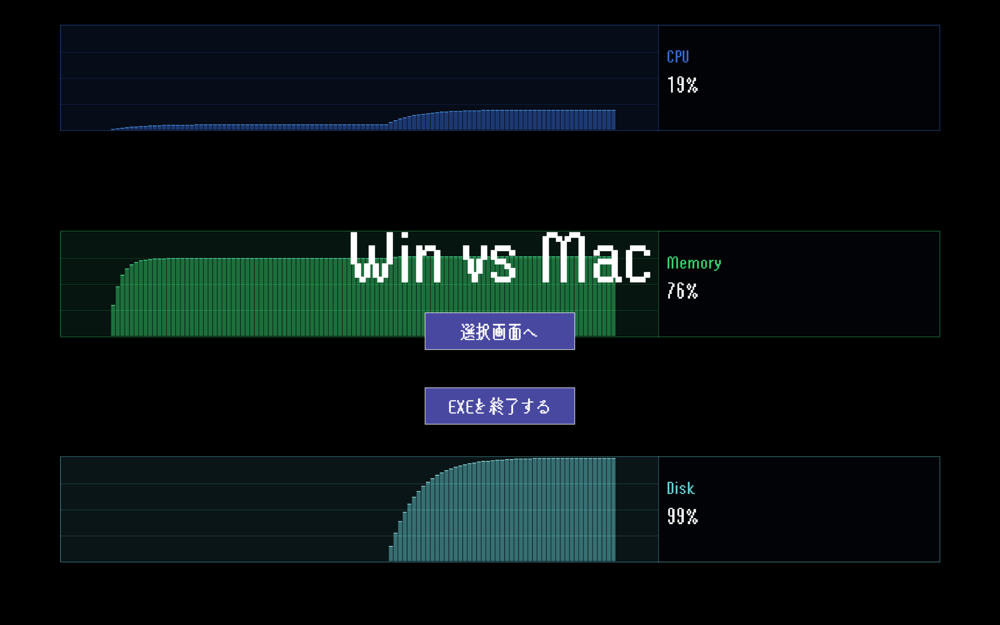
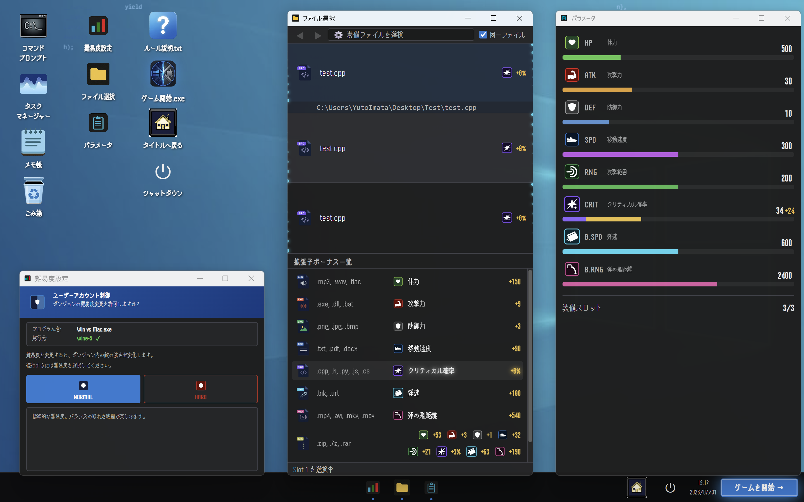
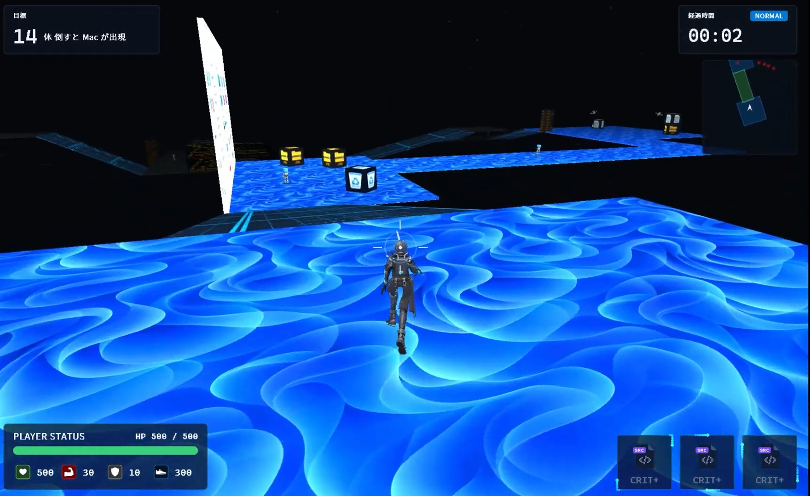
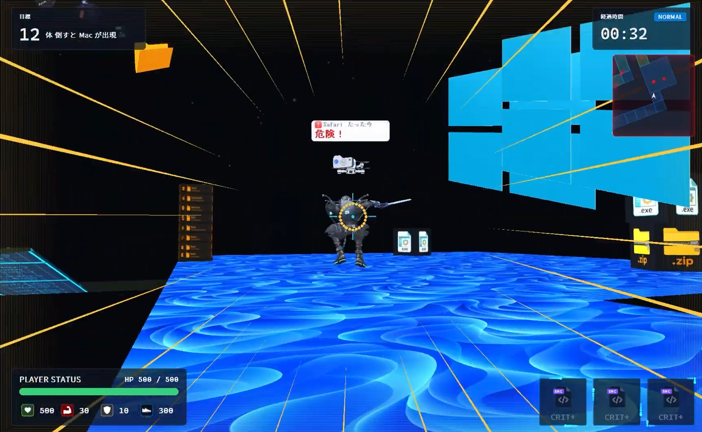
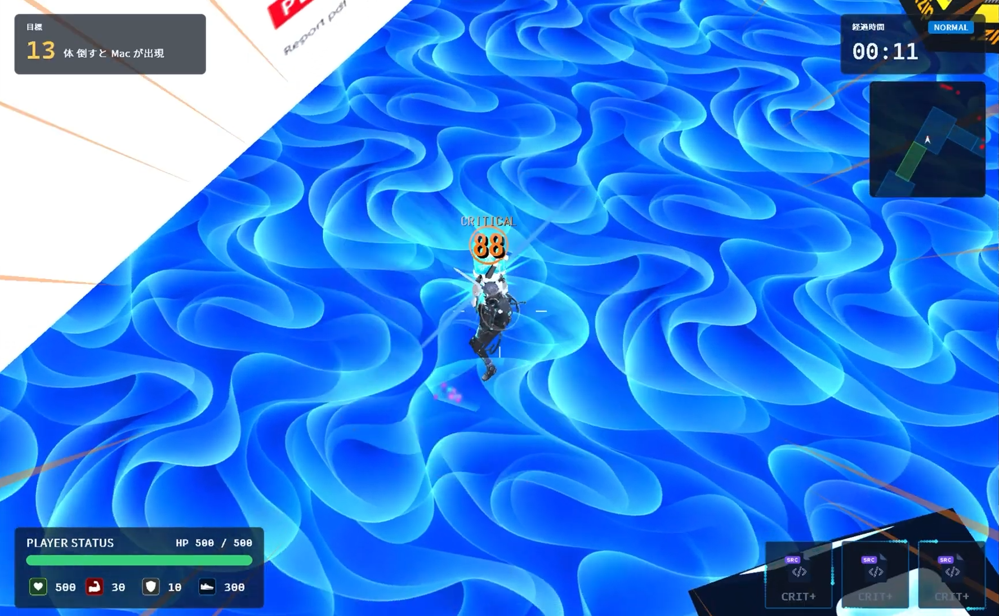
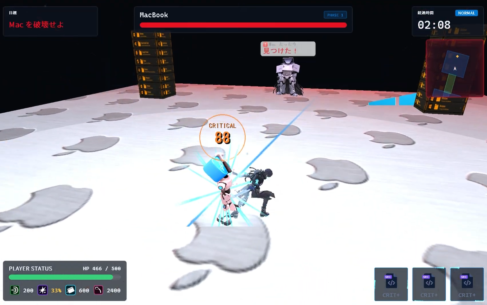

# WIN vs MAC
**自分のWindowsを武器に、MacBookを倒す**

## 概要

WIN vs MAC は、**PC内部を舞台にしたダンジョンRPG**です。プレイヤーはWindows OS内部のデジタル存在となり、自身のシステムリソース（CPU、メモリ、プロセス）を武器に、ダンジョンを攻略し最終ボスである MacBook を撃退します。

---

## プレイ動画

[](https://youtu.be/mW9KkOX3Gpc)

▶ **[YouTube で見る](https://youtu.be/mW9KkOX3Gpc)**

---

## スクリーンショット

### タイトル画面
実行中のPCの **CPU・メモリ・ディスク使用率がそのままグラフの背景**になります。起動した瞬間から「自分のPCの中にいる」ことが伝わる導入です。



### 装備選択画面
Windows デスクトップを模したUI上で、**実際に自分のPCにあるファイルを選んで装備**します。選んだファイルの拡張子でステータスが変化し（`.cpp` ならクリティカル率、`.mp4` なら弾の飛距離など）、難易度選択は UAC ダイアログ風に演出しています。



### ダンジョン探索・戦闘
| | |
|---|---|
|  |  |
| ダンジョン内の探索。目標・経過時間・ミニマップ・装備スロットを常時表示 | 敵プロセスの索敵。Windows のトースト通知を模した演出で敵の状態を通知 |
|  |  |
| 装備した拡張子ボーナスが乗ったクリティカルヒット | 最終ボス MacBook 戦。フェーズ制のボスバトル |

---

<div style="border: 2px solid #0366d6; border-radius: 8px; padding: 20px; margin: 20px 0; background-color: #f6f8fa;">
<h2 style="margin-top: 0; color: #0366d6;">ゲームの特徴</h2>

### 独創的な世界観
- **背景**：プレイヤーはPC内部のデジタル存在
- **最終目標**：MacBook（最終ボス）の撃退

### ビジュアルテイスト
| 要素 | スタイル |
|---|---|
| **ゲーム世界** | モダンなダーク系・サイバー風（黒背景・ネオンカラー） |
| **UI要素** | 実際のWindows UIを模倣した本物っぽいデザイン |

### Windowsとの連携
- プレイヤーが倒す敵はプロセス（Chrome.exe など）
- CPU使用率、メモリ使用量などのシステムデータを活用
- 拡張子（.exe, .dll など）がゲーム内での武器システムに統合

</div>

---

<div style="border: 2px solid #6f42c1; border-radius: 8px; padding: 20px; margin: 20px 0; background-color: #f6f8fa;">
<h2 style="margin-top: 0; color: #6f42c1;">アーキテクチャ設計</h2>

このプロジェクトは、**堅牢な依存関係管理**を重視した設計をしています。

### レイヤードアーキテクチャ + ECS

```
┌─────────────────────────────────────────────────┐
│  Platform層                                     │
│  (Windows API) → データ取得（CPU、メモリなど） │
│  ┌───────────────────────────────────────────┐ │
│  │  Infrastructure層                         │ │
│  │  (DxLib) → 描画、入力、サウンド管理      │ │
│  │  ┌─────────────────────────────────────┐ │ │
│  │  │  Game層                             │ │ │
│  │  │  ゲームロジック（ECS設計）          │ │ │
│  │  └─────────────────────────────────────┘ │ │
│  └───────────────────────────────────────────┘ │
│                                                │
│  ┌───────────────────────────────────────────┐ │
│  │  Core層（全層で共有）                    │ │
│  │  EventBus、ServiceLocator、インターフェース│ │
│  └───────────────────────────────────────────┘ │
└─────────────────────────────────────────────────┘
```

#### 各レイヤーの責務
| レイヤー | 責務 | 特徴 |
|---|---|---|
| **Core** | 全層共通基盤 | EventBus、ServiceLocator、インターフェース定義 |
| **Game** | ゲームロジック（ECS） | DxLib / Windows API に直接依存しない |
| **Infrastructure** | DxLib ラッパー | 描画・入力・サウンド。ゲームロジックを持たない |
| **Platform** | Windows API ラッパー | CPU・メモリ取得、ファイル操作、プロセス情報 |

#### ECS (Entity-Component-System)
- **Entity** = ただのID
- **Component** = データのみ（座標、HP、AI情報など）
- **System** = 処理のみ（更新ロジック）

```cpp
// Player 生成例
EntityId player = entityManager.create();
componentManager.add<TransformComponent>(player, {});
componentManager.add<HealthComponent>(player, {});
componentManager.add<RenderComponent>(player, {modelHandle});
```

#### イベント駆動アーキテクチャ
System間の結合度を下げるため EventBus でイベント通信：

```cpp
// BattleSystem が敵撃破イベントを発行
eventBus.emit<EnemyDefeatedEvent>({enemyId, "chrome.exe"});

// SoundManager がイベント購読して効果音を再生
eventBus.subscribe<EnemyDefeatedEvent>([](const auto& e) {
    audioManager->play("enemy_defeated");
});
```

#### インターフェース経由でのOS依存処理
Game層が Windows API を直接触らないよう、インターフェース経由でアクセス：

```cpp
// ✅ 正しい方法
ISystemDataProvider* provider = ServiceLocator::get<ISystemDataProvider>();
float cpuUsage = provider->getCpuUsage();

// ❌ 禁止（DxLib や Windows API の直接利用）
#include <windows.h>
DWORD cpu = GetSystemTimes(...);
```

</div>

---

<div style="border: 2px solid #28a745; border-radius: 8px; padding: 20px; margin: 20px 0; background-color: #f6f8fa;">
<h2 style="margin-top: 0; color: #28a745;">技術スタック</h2>

| 項目 | 選択 | 理由 |
|---|---|---|
| **言語** | C++ (C++20) | 高性能・3Dゲーム開発の標準 |
| **描画ライブラリ** | DxLib | Windows 専用、日本語ドキュメント充実 |
| **対応OS** | Windows 10 以上 | DxLib と Windows API の活用 |
| **ビルドシステム** | MSBuild (Visual Studio) | DxLib の静的リンク構成をそのまま扱える |

</div>

---

<div style="border: 2px solid #fd7e14; border-radius: 8px; padding: 20px; margin: 20px 0; background-color: #f6f8fa;">
<h2 style="margin-top: 0; color: #fd7e14;">プロジェクト構成</h2>

```
src/
├── core/                    # 共通基盤（全層で利用）
│   ├── ecs/                # Entity-Component-System 実装
│   └── utility/            # ユーティリティ
├── game/                   # ゲームロジック（ECS ベース）
│   ├── component/         # Component 定義
│   ├── system/            # System 実装
│   ├── scene/             # シーン管理
│   ├── event/             # イベント定義
│   └── factory/           # Entity 生成ファクトリ
├── infrastructure/        # DxLib ラッパー層
│   ├── Renderer.h/cpp     # 3D描画管理
│   ├── InputManager.h/cpp # キー入力管理
│   └── SoundManager.h/cpp # サウンド管理
└── platform/              # Windows API ラッパー層
    ├── WindowsSystemProvider.h/cpp    # CPU・メモリ情報取得
    ├── WindowsFileSystemProvider.h/cpp # ファイル操作
    └── WindowsProcessProvider.h/cpp    # プロセス列挙
```

</div>

---

<div style="border: 2px solid #dc3545; border-radius: 8px; padding: 20px; margin: 20px 0; background-color: #f6f8fa;">
<h2 style="margin-top: 0; color: #dc3545;">セットアップ・ビルド方法</h2>

### 必要な環境
- **OS**: Windows 10 以上
- **Visual Studio**: 2022（C++20 対応の MSVC。「C++ によるデスクトップ開発」ワークロード）
- **DxLib**: `thirdparty/` に同梱済み（別途インストール不要）

### ビルド手順

```bash
# リポジトリをクローン
git clone https://github.com/wine-5/DxLib-3D-Game.git
cd DxLib-3D-Game
```

1. `DxLib-3D.sln` を Visual Studio 2022 で開く
2. 構成を **x64 / Release** に設定する
3. `Ctrl + Shift + B` でビルド（または F5 で実行）

### 実行
```
x64/Release/WinVsMac.exe
```

リソースを `assets/...` の相対パスで読み込んでいるため、**リポジトリ直下を作業ディレクトリにして起動**してください（Visual Studio から F5 で実行する場合は既定でこの状態になります）。

</div>

---

<div style="border: 2px solid #20c997; border-radius: 8px; padding: 20px; margin: 20px 0; background-color: #f6f8fa;">
<h2 style="margin-top: 0; color: #20c997;">設計のこだわり</h2>

### 1. **依存関係の一方向化**
内側の層が外側の層をインクルードしない堅牢な設計。
DxLib や Windows API の変更がゲームロジックに影響しないように分離。

### 2. **ECS による高い拡張性**
Player や Enemy というクラスではなく、Entity に Component を組み合わせることで、
新しいゲームオブジェクトを簡単に追加可能。

### 3. **イベント駆動で結合度を低下**
System 間が EventBus を使ってイベント通信することで、
直接的な依存を排除。

### 4. **インターフェース経由で OS 依存を隔離**
Game層が Windows API を直接呼ばないよう、Core層に定義したインターフェース経由でのみアクセス。
テスト時のモック置き換えも容易。

</div>

---

<div style="border: 2px solid #495057; border-radius: 8px; padding: 20px; margin: 20px 0; background-color: #f6f8fa;">
<h2 style="margin-top: 0; color: #495057;">開発者</h2>

**YutoImata** - ソロ開発

このプロジェクトは就職活動向けのポートフォリオ作品です。

</div>

---

## ライセンス

このプロジェクトはオープンソースではありません。

---

## フィードバック・質問

設計や実装に関する質問・指摘があれば、Issue を作成してください。
